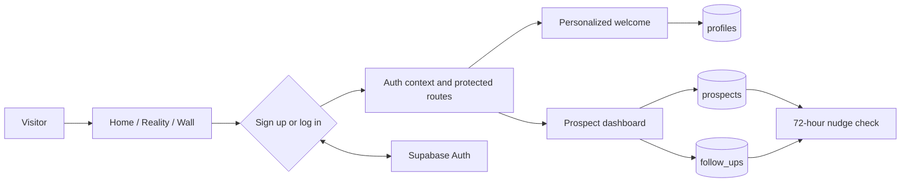

# Grit

> **Your first client is out there. Stop losing track of them.**

Grit is a lightweight client-acquisition workspace for solo freelancers. It turns scattered leads, forgotten follow-ups, and loose conversation notes into five clear stages: **Scout → Reach out → Respond → Scope → Win**.

**Live app:** [grit-app-cyan.vercel.app](https://grit-app-cyan.vercel.app/)

## The Problem

Early-stage freelancers rarely need a heavyweight sales platform. They need to remember who they contacted, what happened, and what to do next. That context is often scattered across email drafts, notes apps, social messages, and browser tabs. Follow-ups get missed not because the freelancer lacks a CRM, but because there is no simple, dependable place to keep the next action visible.

## The Approach

Grit models getting a first client as a short route with five practical holds. Each prospect has a stage, context, source, and contact timestamp. Follow-up notes stay attached to the prospect, and a **72-hour nudge** highlights active prospects that may need attention.

The product is intentionally focused on a solo workflow: capture a prospect, keep the conversation moving, and make the next action obvious.

## Product Walkthrough

1. Explore the product story and five-stage method on the home, Reality, and Wall pages.
2. Create an account or log in; the signed-in user lands on a personalized welcome page.
3. Add a prospect to the dashboard with a name, contact information, and source.
4. Move the prospect through the pipeline and log follow-up notes on its card.
5. Return to the dashboard to see prospects that have passed the 72-hour nudge threshold.

## Features

- **Five-stage prospect board:** Not Contacted, Reached Out, Responded, Negotiating, and Won.
- **Prospect capture:** Save a prospect’s name, contact details, source, and current stage.
- **Follow-up notes:** Save notes against a prospect and review them on its card.
- **72-hour nudge:** Active prospects are flagged once 72 hours have passed since their last contact timestamp. Logging a note or moving a prospect updates that timestamp.
- **Pipeline overview:** See active prospects, responses, wins, and conversion rate.
- **Lost prospects:** Mark prospects lost and view them separately from the active board.
- **Account flow:** Sign up, log in, see a personalized welcome, and sign out from the profile menu.
- **Responsive layout:** Dashboard columns and forms adapt to phone, tablet, and desktop widths.

## Architecture



### Main Routes

| Route | Purpose | Access |
| --- | --- | --- |
| `/` | Product overview and primary call to action | Public |
| `/the-reality` | The problem and product motivation | Public |
| `/the-wall` | The five-stage method | Public |
| `/sign-up` | Account creation | Public |
| `/login` | Email/password login | Public |
| `/welcome` | Personalized post-signup welcome | Authenticated |
| `/dashboard` | Prospect pipeline and follow-up workflow | Authenticated |

## Built With

- **React 19** for the interface
- **Vite 8** for local development and production builds
- **React Router** for client-side routes and protected pages
- **Supabase Auth** for accounts and sessions
- **Supabase Postgres** for profiles, prospects, and follow-up notes
- **CSS** for the visual system and responsive layouts
- **Vercel** for production hosting and SPA route rewrites

## Run Locally

### Requirements

- Node.js 22 or newer
- npm
- A Supabase project configured for this app

### Install and start

```bash
npm install
npm run dev
```

Vite prints the local URL when the development server starts.

### Environment variables

Create a `.env` file in the project root. Use your own Supabase project values:

```dotenv
VITE_SUPABASE_URL=https://<project-ref>.supabase.co
VITE_SUPABASE_ANON_KEY=<publishable-or-anon-key>
```

The `VITE_` prefix is required because these values are read by Vite in browser code. A Supabase publishable/anon key is designed for client use; protect the database with Row Level Security. **Never put a Supabase `service_role` key in a frontend environment variable or commit it to this repository.**

Without these variables, public pages can still render, but signup, login, and database-backed dashboard features are unavailable.

## Supabase Data and Security

The frontend expects these tables and fields:

| Table | Fields used by the app |
| --- | --- |
| `profiles` | `id` (same UUID as `auth.users.id`), `full_name` |
| `prospects` | `id`, `user_id`, `name`, `contact_info`, `source`, `status`, `last_contacted_at`, `created_at` |
| `follow_ups` | `prospect_id`, `note` |

The dashboard reads and writes these rows using the signed-in user’s client session. Configure Row Level Security so:

- A user can read and insert only their own profile (`auth.uid() = profiles.id`).
- A user can read, insert, and update only their own prospects (`auth.uid() = prospects.user_id`).
- A user can read and insert follow-ups only when the referenced prospect belongs to them.

The repository does not currently include Supabase migrations or SQL policy definitions. Set up the tables and policies in the Supabase project before expecting signup and dashboard writes to work. Signup directly inserts a profile after account creation; if email confirmation is enabled, use an Auth database trigger to create the profile or ensure profile creation waits until a session exists.

## Deploy on Vercel

Connect the GitHub repository to Vercel and set these **Production** environment variables in the project settings:

- `VITE_SUPABASE_URL`
- `VITE_SUPABASE_ANON_KEY`

Set them for Preview too if preview deployments should connect to Supabase. Environment changes apply to new deployments, so redeploy after changing them. The included [`vercel.json`](vercel.json) rewrites client-side routes to `index.html`, allowing routes such as `/login` and `/dashboard` to load directly.

## Development Checks

```bash
npm run lint
npm run build
npm run preview
```

`npm run build` creates the production bundle in `dist/`. The project currently has lint and build scripts; it does not define a separate automated test script.

## AI Assistance Disclosure

**AI was used as a development assistant, not as the sole author or product decision-maker.** The coding agent used was **GitHub Copilot in VS Code**. It assisted with scoped implementation and debugging tasks, including responsive styling, Supabase authentication and profile flows, dashboard behavior, deployment troubleshooting, and this documentation draft.

The product direction and requested workflows were provided by the project developer. AI-generated suggestions were integrated and checked against the repository; lint, production builds, and browser behavior were used to validate changes. The project developer remains responsible for the application, its database policies, environment configuration, and final decisions.
